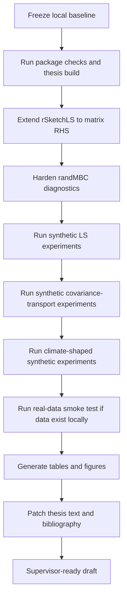

# Experiments Index

This document reconstructs the planned thesis experiment program from the roadmap,
the current package surface, and the existing scripts in `experiments/`,
`packages/rSketchLS/`, `packages/randMBC/`, and `src/octave/`.

## Master Seed

All standardized thesis experiment scripts should default to:

```text
MASTER_SEED = 20260527L
```

Per-trial seeds should be derived deterministically from `MASTER_SEED` and the
parameter combination so that reruns are reproducible and parallel-safe.

## Workflow



## Output Contract

Every standardized experiment run directory should contain the following files.

| Path                | Meaning                                                                                                              |
| ------------------- | -------------------------------------------------------------------------------------------------------------------- |
| `config.yaml`       | Serialized run configuration: dimensions, method, sweep grid, trial count, precision settings, and seed information. |
| `git_sha.txt`       | Current repository commit SHA or a clear dirty-worktree marker if run outside a clean commit.                        |
| `sessionInfo.txt`   | Runtime environment summary, typically `sessionInfo()` for R-based scripts.                                          |
| `trial_metrics.csv` | One row per trial and parameter combination.                                                                         |
| `summary.csv`       | Aggregated summary by sweep key, with means, standard deviations, and medians where relevant.                        |
| `figures/`          | Run-local figure outputs used later by the thesis chapter.                                                           |

Notes:

- `packages/rSketchLS/R/sketch_lstsq_experiment_multi.R` already writes the core subset `config.yaml`, `trial_metrics.csv`, and `summary.csv`.
- Existing `experiments/` scripts currently mix `results/`, `figures/`, and `experiments/output/`; the 01-09 layer should normalize them to the contract above.

## Planned Scripts 01-09

### `01_freeze_baseline`

| Field           | Content                                                                                                                              |
| --------------- | ------------------------------------------------------------------------------------------------------------------------------------ |
| Purpose         | Freeze the local baseline before heavy experimentation: package status, thesis build status, and reproducibility metadata.           |
| Inputs          | Current git worktree, package directories, thesis sources, `MASTER_SEED`.                                                            |
| Outputs         | `config.yaml`, `git_sha.txt`, `sessionInfo.txt`, package-check logs, thesis build log, optional `summary.csv` with pass/fail status. |
| Thesis support  | Global reproducibility layer; supports `NumericalExperiments.tex` methodology framing.                                               |
| Current anchors | No single script yet; implied by `containers/`, package tests, and thesis build workflow.                                            |
| Status          | Planned.                                                                                                                             |

### `02_ls_sketch_sweep`

| Field           | Content                                                                                                                                 |
| --------------- | --------------------------------------------------------------------------------------------------------------------------------------- |
| Purpose         | Synthetic least-squares sketch-size sweep across Gaussian, Rademacher, and SRHT sketches.                                               |
| Inputs          | Synthetic `A`, planted `x_true`, noisy or noiseless `b`, sketch family, sketch-size grid `s`.                                           |
| Outputs         | `trial_metrics.csv` with residual norms, residual ratios, solution errors, and `kappa(SA)`; `summary.csv`; figures of error versus `s`. |
| Thesis support  | `RandomizedLeastSquares.tex`; `NumericalExperiments.tex` section on sketch-size sweep.                                                  |
| Current anchors | `packages/rSketchLS/R/experiments.R`, `src/octave/compare_sketches.m`, `src/octave/sketch_experiment.m`.                                |
| Status          | Implemented in package/prototype form; needs standardized top-level script wrapper.                                                     |

### `03_ls_mixed_sketch_precision`

| Field           | Content                                                                                                                       |
| --------------- | ----------------------------------------------------------------------------------------------------------------------------- |
| Purpose         | Hold solve precision fixed and vary sketch-formation precision to identify when `fl(SA)` begins to degrade LS quality.        |
| Inputs          | Synthetic LS problem, sketch family, sketch-size grid, `sketch_prec in {double,single,half,bfloat16}`, `solve_prec = double`. |
| Outputs         | Trial and summary tables for residual ratio, solution error, `kappa(SA)`, plus precision-sensitivity figures.                 |
| Thesis support  | `MixedPrecision.tex`; `NumericalExperiments.tex` mixed-precision sketch-formation section.                                    |
| Current anchors | `packages/rSketchLS/R/sketch_lstsq_mixed.R`, `src/octave/mixedprec_experiment.m`.                                             |
| Status          | Implemented in components; standardized experiment wrapper still planned.                                                     |

### `04_ls_mixed_solve_precision`

| Field           | Content                                                                                                        |
| --------------- | -------------------------------------------------------------------------------------------------------------- |
| Purpose         | Hold sketch formation fixed in high precision and vary the reduced-system solve precision.                     |
| Inputs          | Synthetic LS problem, sketch-size grid, `sketch_prec = double`, `solve_prec in {double,single,half,bfloat16}`. |
| Outputs         | Same contract as script 03, but keyed to solve precision.                                                      |
| Thesis support  | `MixedPrecision.tex`; `NumericalExperiments.tex` reduced-system solve discussion.                              |
| Current anchors | `packages/rSketchLS/R/sketch_lstsq_mixed.R`, `src/octave/mixedprec_experiment.m`.                              |
| Status          | Implemented in components; standardized experiment wrapper still planned.                                      |

### `05_ls_conditioning_sweep`

| Field           | Content                                                                                                               |
| --------------- | --------------------------------------------------------------------------------------------------------------------- |
| Purpose         | Study the interaction between prescribed condition number, sketch quality, and precision.                             |
| Inputs          | Controlled-spectrum synthetic matrix `A`, target `kappa`, fixed sketch size or sweep, precision choice.               |
| Outputs         | Trial-level conditioning/error tables and phase-transition figures versus `kappa(A)`.                                 |
| Thesis support  | `RandomizedLeastSquares.tex` conditioning proposition and `NumericalExperiments.tex` ill-conditioned regime section.  |
| Current anchors | `packages/rSketchLS/R/generate_conditional.R`, `src/octave/generate_conditional.m`, `src/octave/exp4_conditioning.m`. |
| Status          | Implemented in prototype/helper form; standardized script still planned.                                              |

### `06_ls_refinement`

| Field           | Content                                                                                                                           |
| --------------- | --------------------------------------------------------------------------------------------------------------------------------- |
| Purpose         | Test whether iterative refinement recovers accuracy after low-precision sketch-and-solve.                                         |
| Inputs          | Synthetic LS instances, sketch settings, mixed-precision settings, `ref_steps`.                                                   |
| Outputs         | Trial tables with residual history and final error metrics; refinement convergence figures.                                       |
| Thesis support  | `MixedPrecision.tex`; `RandomizedLeastSquares.tex` sketch-and-precondition bridge; `NumericalExperiments.tex` refinement section. |
| Current anchors | `packages/rSketchLS/R/iterative_refine.R`, `src/octave/iterative_refine.m`, `src/octave/exp5_refinement.m`.                       |
| Status          | Implemented in core routines; standardized script still planned.                                                                  |

### `07_cov_transport_synthetic`

| Field           | Content                                                                                                                                             |
| --------------- | --------------------------------------------------------------------------------------------------------------------------------------------------- |
| Purpose         | Systematic covariance-transport sweeps on analytic synthetic covariance operators.                                                                  |
| Inputs          | Spectrum type (`exponential`, `linear`, `gap`), rank grid, lambda grid, sketch family, precision grid, trial count.                                 |
| Outputs         | Per-trial transport metrics and summary tables over covariance error, transport error, regularized minimum eigenvalue, condition estimate, runtime. |
| Thesis support  | `RandomizedCovarianceTransport.tex`; `NumericalExperiments.tex` covariance-transport sweep tables.                                                  |
| Current anchors | `experiments/cov_transport_sweep.R`, `packages/randMBC/R/experiment_runner.R`, `packages/randMBC/R/diagnostics.R`.                                  |
| Status          | Already implemented and runnable; outputs currently land in `experiments/output/`.                                                                  |

### `08_cov_transport_climate_shaped`

| Field           | Content                                                                                                                                    |
| --------------- | ------------------------------------------------------------------------------------------------------------------------------------------ |
| Purpose         | Validate randomized covariance transport in climate-shaped synthetic regimes, including shared-basis versus independent-basis comparisons. |
| Inputs          | Latent triplets with structured spectra, block mixing, rank grid, oversampling, lambda, precision, basis mode.                             |
| Outputs         | Raw tables, summary tables, covariance-error and transport-error figures, basis-mode comparison summaries.                                 |
| Thesis support  | `RandomizedCovarianceTransport.tex` shared-basis discussion; `NumericalExperiments.tex` regime-identification framework.                   |
| Current anchors | `experiments/randmbc_synthetic_validation.R`, `packages/randMBC/R/problem_ensemble.R`, `packages/randMBC/R/covariance_approximation.R`.    |
| Status          | Implemented and already writing reproducible CSV/RDS outputs under `results/`.                                                             |

### `09_climate_smoke_test`

| Field           | Content                                                                                                                                        |
| --------------- | ---------------------------------------------------------------------------------------------------------------------------------------------- |
| Purpose         | Run the real-data application smoke test when real climate data exist locally, with CCCma as fallback.                                         |
| Inputs          | `x_hist`, `y_hist`, `x_fut` from local climate data or fallback CCCma/MBC-shaped data, method settings, rank, oversampling, precision, lambda. |
| Outputs         | Benchmark table versus deterministic full covariance transport and `src/MBC` references, quick plots, and application-level diagnostics.       |
| Thesis support  | `ClimateApplication.tex`; final application chapter and benchmark comparison tables.                                                           |
| Current anchors | `experiments/benchmark_randmbc.R`, `experiments/randmbc_benchmark_helpers.R`, `packages/randMBC/R/rand_mbc.R`, vendored `src/MBC/`.            |
| Status          | Partly implemented as a synthetic benchmark; real local-data smoke test remains pending.                                                       |

## Existing Script Crosswalk

| Existing script                              | Closest planned slot                                          |
| -------------------------------------------- | ------------------------------------------------------------- |
| `packages/rSketchLS/R/experiments.R`         | `02_ls_sketch_sweep`                                          |
| `packages/rSketchLS/R/sketch_lstsq_mixed.R`  | `03_ls_mixed_sketch_precision`, `04_ls_mixed_solve_precision` |
| `packages/rSketchLS/R/iterative_refine.R`    | `06_ls_refinement`                                            |
| `src/octave/compare_sketches.m`              | `02_ls_sketch_sweep`                                          |
| `src/octave/mixedprec_experiment.m`          | `03_ls_mixed_sketch_precision`, `04_ls_mixed_solve_precision` |
| `src/octave/exp4_conditioning.m`             | `05_ls_conditioning_sweep`                                    |
| `src/octave/exp5_refinement.m`               | `06_ls_refinement`                                            |
| `experiments/cov_transport_sweep.R`          | `07_cov_transport_synthetic`                                  |
| `experiments/randmbc_synthetic_validation.R` | `08_cov_transport_climate_shaped`                             |
| `experiments/benchmark_randmbc.R`            | `09_climate_smoke_test`                                       |

## Recommended Naming Convention

When the standardized wrappers are added, prefer the following file names under `experiments/`:

```text
01_freeze_baseline.R
02_ls_sketch_sweep.R
03_ls_mixed_sketch_precision.R
04_ls_mixed_solve_precision.R
05_ls_conditioning_sweep.R
06_ls_refinement.R
07_cov_transport_synthetic.R
08_cov_transport_climate_shaped.R
09_climate_smoke_test.R
```

This keeps the experiment chapter, result directories, and run ordering aligned.
